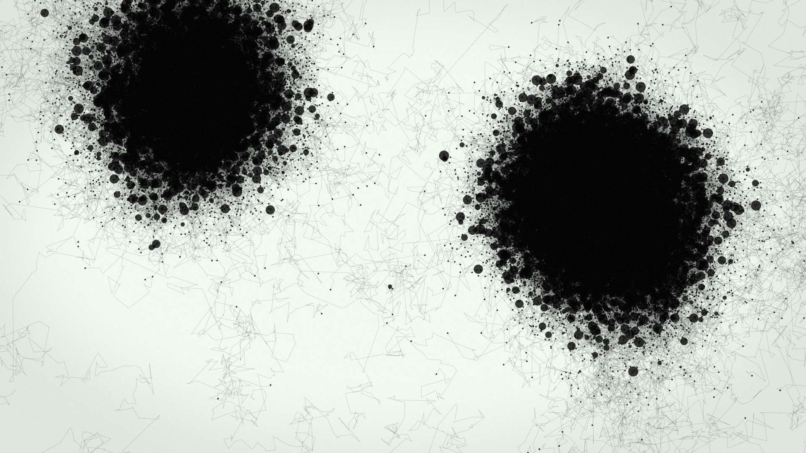

# Wandering Ants
Simple algorithm for crawling and reproducing ants, initially designed for a [NodeBox](https://www.nodebox.net/) workshop. Each time two ants meet, they produce offspring. However, nobody dies, so the population grows explosively.

[Video](https://youtu.be/jYs9WNQfG80)

## Building (OS X, with Homebrew)

    brew install sdl2
    ./build.sh

## Running

    ./ants

Note that, because none of the ants die, the algorithm will keep on generating new ants, grinding the algorithm to a halt. That's sort of the point.

## Hacking
The `src/ants.c` file has a number of `#define` you can tweak to your heart's content. Try changing the `RANDOM_SEED`.

To save out an image sequence, set `SAVE_FRAME` to `1`. Frames will be saved out in TGA format in the `OUT_DIRECTORY`.

## Thanks
The project uses the [SDL](https://www.libsdl.org/), [STB](https://github.com/nothings/stb) and [NanoVG](https://github.com/memononen/nanovg) libraries.

## License
This project is licensed under the [MIT License](https://opensource.org/licenses/MIT).
